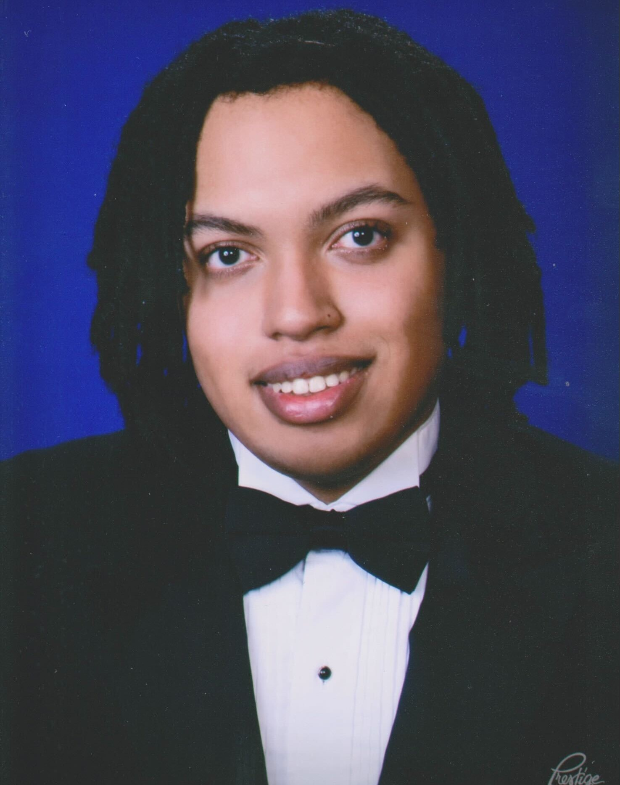
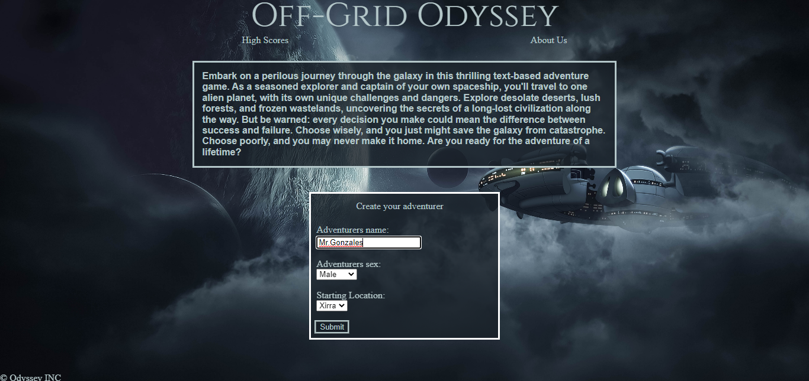
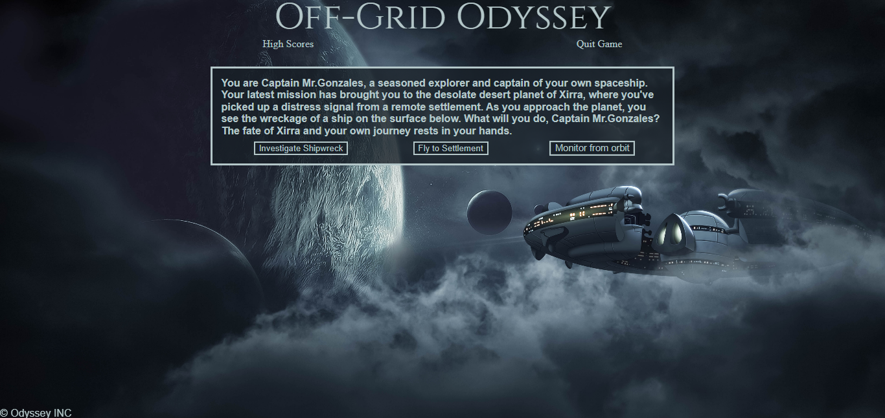
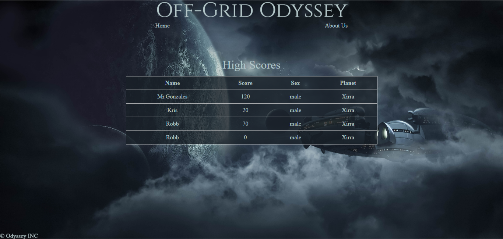
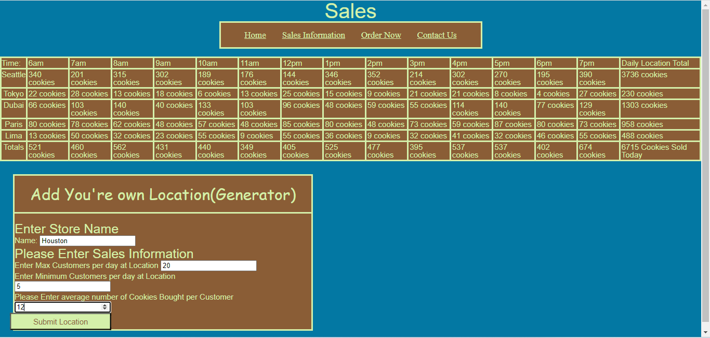
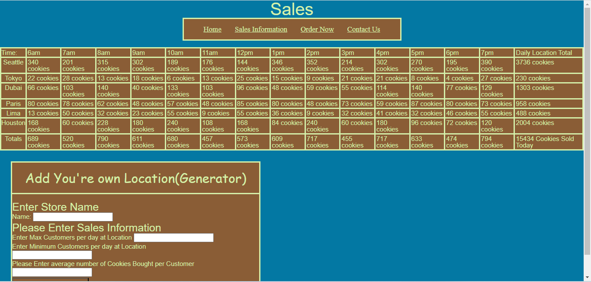
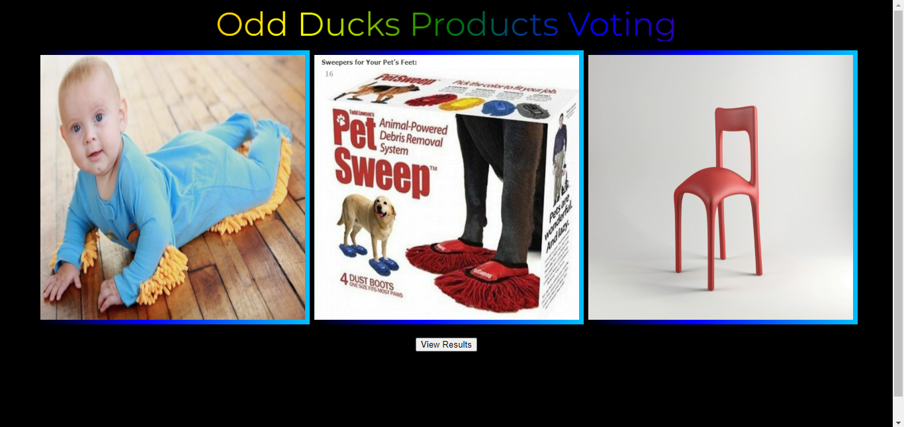
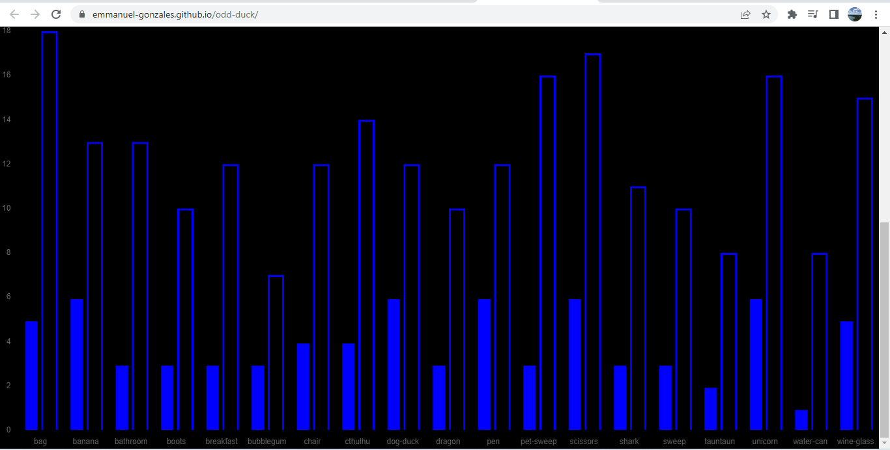

# Porfolio Prep

Title: All Stacks Software Developer

Personal Headline: An upcoming software developer. I have a love for movies, games and all art forms. Physical and mental health is important to me. Looking forward to making an impact on the industry.

Professional Pitch: Hello my name is Emmanuel Gonzales I am a full stack JavaScript software developer. I am proficient in JavaScript and Python, and well versed in Git, GitHub, Linux and other code software tools. I am very proficient with CSS, I am able to make a website layout match the wire frame and I have the ability to choose readable colors for the website.I also have the ability to solve problems in vanilla JavaScript using full access to it’s resources. I come from a background that includes working in teams on projects and assignments, I work well with others. I desire to change people's lives and help companies with my skills.

Technology runs the world at this moment in time and I would love to contribute to it. From space travel to communication, the potential of how advanced humans can become excites me the most.

Images:

* Image of Projects

